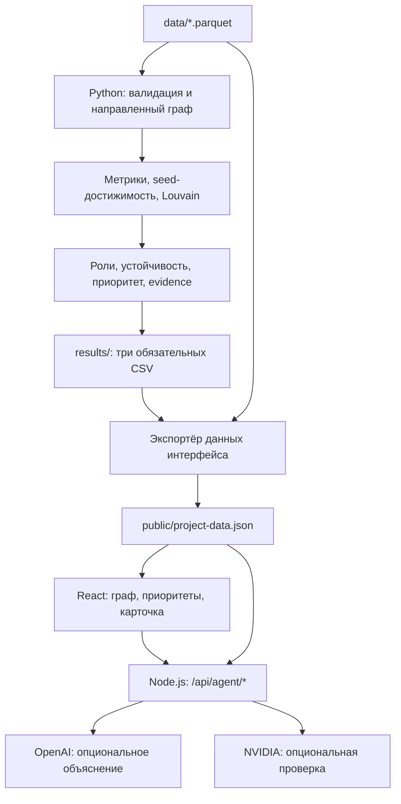

# MoneyGraph Investigator

**Объяснимый анализ графа денежных переводов для AML-аналитика.** Проект команды Aman AI для HackAlem AI, кейс «Граф денег».

MoneyGraph помогает специалисту финансового мониторинга ответить на вопрос: **«Какие узлы проверять в первую очередь и почему?»** Из обезличенной выгрузки переводов система строит направленную сеть, рассчитывает функциональные роли и приоритеты, выделяет сообщества и показывает численные основания в интерфейсе.

Роли — гипотезы для дальнейшей проверки. Оценки системы не являются вероятностью нарушения, а структура графа не доказывает виновность или принадлежность к преступной группе.

## Быстрый запуск для организаторов

Нужны **Python 3.12+ (кроме 3.14.1; проверено на 3.14.6)** и **Node.js 22.18+ с npm**. Из корня репозитория:

```bash
python3 scripts/run-local.py
```

Команда создаёт `.venv`, устанавливает зафиксированные зависимости Python и npm, **дважды запускает `main.py`**, сравнивает все три CSV побайтово, готовит данные интерфейса, собирает приложение и открывает локальный сервер: **[http://127.0.0.1:5173](http://127.0.0.1:5173)**. Откройте этот адрес в браузере; остановка — `Ctrl+C`. Файл `.env`, AI-ключи, Docker, база данных и заранее подготовленные результаты не нужны. Режим `project` задаётся явно, даже если в окружении разработчика выбран `demo`.

Входные файлы уже включены в текущую версию репозитория. Если организаторы выдали их отдельно, распакуйте архив с папкой `data/` в корень, сохранив исходные имена:

```text
data/
  nodes.parquet          # gid, depth, is_seed
  edges.parquet          # src, dst, sum_kzt, n_tx, depth
  transactions.parquet   # src, dst, date, sum_kzt
```

Это исходный формат [ТЗ](docs/project_description.md) и [описания датасета](starter/READ_2.md). Преобразовывать Parquet в CSV перед запуском не требуется. При отсутствии любого файла команда останавливается с указанием пути. `edges.sum_kzt` — сумма по направленной паре за месяц, а `transactions.sum_kzt` — сумма **одного** перевода; `date` содержит только календарную дату. Канонические суммы берутся из рёбер и сверяются с транзакциями. Браузерный импорт CSV — дополнительный аналитический экран; обязательные роли и три итоговых CSV рассчитываются из полного набора Parquet.

Первой установке нужен доступ к реестрам пакетов (либо заранее подготовленный кеш). Последующие запуски обходятся без установки и сети:

```bash
python3 scripts/run-local.py --skip-install
# Только пересчёт, проверка и production-сборка, без сервера:
python3 scripts/run-local.py --skip-install --prepare-only
# Если порт занят:
python3 scripts/run-local.py --skip-install --port 5180
```

Результаты находятся в `results/{nodes_roles,clusters,top_nodes}.csv`, сборка — в `apps/frontend/dist/`. Локальный `results/reproducibility.json` фиксирует контрольные суммы входов и выходов, длительность обоих пересчётов и размер графа. Для этого набора ожидаются **2 248 узлов, 3 119 рёбер, 4 840 транзакций, 81 исходный клиент, 65 сообществ и 20 строк топ-листа**. Пятиминутный лимит проверяется для каждого пересчёта отдельно; установка зависимостей и сборка интерфейса в него не входят.

В Windows используйте `py -3 scripts/run-local.py`; расположение Python внутри `.venv` определяется автоматически.

## Что реализовано

- **Локальный воспроизводимый пайплайн:** проверка трёх Parquet-файлов, расчёт метрик и создание обязательных CSV одной командой `python main.py`. После установки зависимостей ему не нужны интернет, GPU, AI-ключи или база данных.
- **Объяснимые роли и приоритеты:** шесть правил оценки, отдельные `role_score` и `priority_score`, текстовое обоснование для каждого узла, топ-20 кандидатов для проверки.
- **Анализ структуры:** входящие и исходящие объёмы и связи, PageRank, betweenness, достижимость от исходных клиентов, сообщества Louvain. Для 50 предварительно приоритетных узлов рассчитывается влияние удаления на связность и достижимость сети.
- **Интерактивный граф:** поиск по точному GID, выбор узла, направление и вес переводов, масштабирование, локальный обход на 1–4 перехода и подсветка потока `Trace Flow`. Есть фильтры по роли, кластеру, глубине, seed, приоритету и объёму.
- **Рабочее место аналитика:** список приоритетов, карточка клиента, наблюдаемые потоки, обоснования, сводка кластера и экспорт списка приоритетов и переводов в CSV.
- **Ограничения наблюдения в интерфейсе:** предупреждения о глубине 4 и неполных входящих потоках исходных клиентов; отсутствующие аналитические поля обозначаются как недоступные.
- **Опциональный AI-помощник:** серверная интеграция OpenAI для объяснения рассчитанных фактов со ссылками на GID и отдельная проверка ответа через NVIDIA. Требуются действующие ключи; основной сценарий работает без них.

Текущие файлы дают **2 248 узлов, 3 119 направленных рёбер, 4 840 транзакций, 81 seed-клиента, 65 кластеров и топ-20**. Это характеристики предоставленного набора, а не заявленная точность обнаружения нарушений.

## Как работает решение

1. Пользователь размещает исходную выгрузку в `data/` и запускает `python main.py` в подготовленном окружении либо `python3 scripts/run-local.py` для полного запуска приложения. Данные кейса включены в репозиторий. Дополнительный импорт CSV в браузере показывает наблюдаемые суммы и связи без присвоения аналитических ролей.
2. Пайплайн проверяет схемы, идентификаторы, суммы и соответствие агрегированных рёбер транзакциям. Направленный граф сохраняет циклы и связи между разными уровнями глубины.
3. Рассчитываются метрики, достижимость от seed-клиентов, сообщества, роли, приоритеты и детерминированные текстовые обоснования.
4. Три CSV сохраняются в `results/`. Перед запуском или сборкой интерфейса отдельный экспортёр объединяет их с узлами и рёбрами в локальный `project-data.json`.
5. Аналитик открывает список приоритетов или вводит GID, изучает карточку, связи и кластер, сверяет основания и ограничения. При настроенных ключах он может запросить объяснение у AI-помощника.

### Как определяются роли

Используются формулы, а не обученный классификатор: размеченных правильных ролей в датасете нет. Большинство признаков нормируются относительно узлов **той же глубины**. Для группы из `N` узлов процентиль равен `(средний ранг − 1) / (N − 1)`; одинаковые значения получают одинаковый ранг. Для постоянной, единичной или невалидной группы используется `0`.

Обозначения: `P(x)` — процентиль признака внутри глубины; `I` и `O` — наблюдаемые входящий и исходящий объёмы; `S` — процентиль числа различных seed, от которых существует направленный путь к узлу. Дополнительные признаки:

- `R = I / (I + O)` при положительном знаменателе, иначе `0` — наблюдаемый сигнал удержания.
- `B = max(0, 1 − abs(ln((O + 1)/(I + 1))))` — сходство наблюдаемых входящего и исходящего объёмов.
- `C = 1`, если есть и входящие, и исходящие связи, иначе `0`.
- `Z = 1`, если исходящих связей нет, иначе `0`.
- `T` — временной признак; в текущей версии равен `0`.

| Роль | Формула и применимость |
| --- | --- |
| `consolidator` — признаки консолидации | `0.30·P(отправители) + 0.25·P(I) + 0.30·S + 0.15·R` |
| `transit` — признаки транзита | `0.25·mean(P(in_degree), P(out_degree)) + 0.30·B + 0.25·T + 0.20·C`; только при глубине 1–3. |
| `distributor` — признаки распределения | `0.50·P(получатели) + 0.25·P(O) + 0.25·P(out_degree)` |
| `terminal` — признаки конечного получателя в наблюдаемой сети | `0.50·P(I) + 0.30·R + 0.20·Z`; только при глубине 1–3 и `I > 0`. |
| `coordinator` — структурно значимый узел | `0.30·P(PageRank) + 0.30·P(betweenness) + 0.20·P(число соседних сообществ) + 0.20·S`. Это структурная гипотеза, не утверждение о руководящей роли. |
| `peripheral` — недостаточно выраженных признаков | Выбирается, если все допустимые основные роли имеют оценку ниже `0.55`. Её оценка — `1 − max` пяти основных оценок. |

Иначе выбирается допустимая роль с наибольшей оценкой. При равенстве действует порядок: `coordinator`, `consolidator`, `transit`, `distributor`, `terminal`. `role_score` — оценка выбранной роли, а не вероятность её истинности. В текущей выгрузке правило `transit` реализовано, но ни одному узлу эта роль не выбрана.

`seed_reach_count` считает различные исходные GID с наблюдаемым направленным путём к узлу. Повторные пути от одного seed не увеличивают счётчик; достижимость не доказывает движение одних и тех же денег.

### Приоритет и сообщества

Приоритет проверки рассчитывается отдельно от роли:

```text
priority_score = 0.30 × вес_роли × role_score
               + 0.25 × seed_convergence
               + 0.15 × centrality
               + 0.15 × процентиль_наблюдаемого_объёма
               + 0.10 × temporal
               + 0.05 × resilience_pct
```

`centrality` — среднее процентилей PageRank и betweenness; `temporal` сейчас равен `0`. Веса ролей: `1.0` для consolidator/coordinator, `0.85` для transit, `0.80` для distributor, `0.45` для terminal, `0.15` для peripheral. Устойчивость оценивается для 50 кандидатов по предварительному приоритету: учитываются изменения крупнейшей слабосвязной компоненты и числа достижимых пар «seed → не-seed» после удаления узла. Для остальных вклад равен нулю.

Оценки ограничены диапазоном `[0, 1]`, экспортируются с шестью знаками после запятой. Топ-лист упорядочивается по убыванию приоритета, при равенстве — по GID.

Louvain работает на взвешенной **неориентированной проекции** с весом `log1p(sum_kzt)`, `resolution=1.0` и `seed=42`. Номера сообществ стабилизируются сортировкой по минимальному GID и размеру. Направление денежных потоков анализируется по исходному направленному графу. Сообщество означает структурную связанность переводами.

Подробности: [аналитический дизайн](docs/moneygraph-investigator-design.md), [реализация ролей](apps/backend/moneygraph/roles.py), [расчёт приоритета](apps/backend/moneygraph/priority.py).

## Технологии

| Компонент | Используемые технологии |
| --- | --- |
| Аналитика | Проверено на Python 3.14.6; pandas 3.0.6, PyArrow 25.0.1, NetworkX 3.7, SciPy 1.18.1, NumPy 2.5.3. Полный набор runtime-зависимостей зафиксирован в `requirements.txt`. |
| Форматы данных | Parquet на входе, UTF-8 CSV для результатов, JSON для интерфейса. |
| Интерфейс | TypeScript 6, React 19, Vite 8, Tailwind CSS 4, shadcn/Radix, Lucide, Zod. |
| Визуализация графа | `react-force-graph-2d`, Canvas. |
| Сервер AI | Node.js, официальный SDK `openai`, OpenAI Responses API с вызовом инструментов. Модель по умолчанию в коде: `gpt-4.1-mini`. |
| Проверка AI-ответа | NVIDIA API, `/chat/completions`; модель по умолчанию в коде: `nvidia/nemotron-3-nano-omni-30b-a3b-reasoning`. |
| Проверки | pytest, unittest, Vitest, Oxlint, Playwright MCP. |

Названия AI-моделей — значения конфигурации текущего кода. Их доступность зависит от учётных данных провайдера. Внешние модели не рассчитывают обязательные роли, оценки, кластеры или CSV-обоснования.

## Архитектура проекта



```text
main.py                         # Точка входа обязательного пайплайна
data/                           # Три исходных Parquet-файла
results/                        # Роли, сообщества, топ-20
apps/backend/moneygraph/         # Валидация, граф и аналитические модули
apps/backend/tests/             # Проверки аналитики
apps/frontend/src/              # Интерфейс и адаптеры данных
apps/frontend/scripts/          # Экспорт данных и браузерные проверки
apps/frontend/server/           # Серверная интеграция AI
docs/                           # ТЗ, дизайн и контракты
starter/                        # Исходные материалы организаторов
```

Текущий рабочий путь — **файлы → локальный JSON → интерфейс**. HTTP API аналитики описан в контрактах и поддержан адаптером фронтенда, но его сервер в текущем backend не реализован. Сервер `/api/agent/*` обслуживает только AI-помощника.

## Установка и запуск

### Требования

- Python **3.12+**, кроме **3.14.1** (несовместима с текущим NetworkX); проверено на **3.14.6**. `.python-version` задаёт исходную версию разработки, а не обязательную patch-версию.
- Node.js **22.18 или новее** и npm; требование зафиксировано в пакете frontend.
- Три файла `data/nodes.parquet`, `data/edges.parquet`, `data/transactions.parquet`.
- Интернет для первоначальной установки зависимостей; далее основная аналитика и просмотр работают локально.

Команды ниже выполняются **из корня репозитория** в macOS/Linux. В Windows замените `.venv/bin/python` на `.venv\Scripts\python.exe`; при необходимости задайте `MONEYGRAPH_PYTHON` для экспортёра интерфейса.

### 1. Подготовить Python и рассчитать результаты

Убедитесь, что `python3 --version` показывает нужную версию, затем выполните:

```bash
python3 -m venv .venv
.venv/bin/python -m pip install -r requirements.txt
.venv/bin/python main.py
```

После активации окружения эквивалентная команда полного пересчёта — **`python main.py`**. Для предоставленных данных ожидается сообщение:

```text
MoneyGraph complete: 2248 nodes, 65 clusters, 20 top nodes.
```

| Файл результата | Строк данных | Колонки |
| --- | --- | --- |
| `results/nodes_roles.csv` | 2 248 | `gid,role,role_score,cluster_id,priority_score,evidence` |
| `results/clusters.csv` | 65 | `cluster_id,n_nodes,n_seed,sum_kzt_internal,top_gids,hypothesis` |
| `results/top_nodes.csv` | 20 | `rank,gid,role,priority_score,why` |

GID в JSON передаются строками, в CSV сохраняются точным десятичным текстом. При открытии CSV в табличном редакторе импортируйте GID как текст, чтобы не потерять разряды.

### 2. Запустить интерфейс на данных проекта

```bash
npm --prefix apps/frontend ci
npm --prefix apps/frontend run dev -- --host 127.0.0.1
```

Откройте адрес Vite, обычно [http://127.0.0.1:5173](http://127.0.0.1:5173). Режим по умолчанию — `project`, в интерфейсе отображается **«Данные проекта»**. Файл `.env` для этого сценария не требуется. Если он уже существует, проверьте, что `VITE_DATA_MODE=project`.

Перед `dev` и `build` автоматически запускается экспортёр: проверяет CSV и исходные узлы/рёбра, создаёт игнорируемый Git файл `apps/frontend/public/project-data.json`. Сам экспортёр не запускает аналитический пайплайн. Если источники отсутствуют или невалидны, подготовка завершается ошибкой.

После изменения исходных данных или пересчёта результатов обновите экспорт и перезагрузите страницу:

```bash
.venv/bin/python main.py
npm --prefix apps/frontend run data:project
```

### 3. Собрать и посмотреть production-сборку локально

```bash
npm --prefix apps/frontend run build
npm --prefix apps/frontend run preview -- --host 127.0.0.1
```

Готовые файлы находятся в `apps/frontend/dist/`; адрес предварительного просмотра выводится в терминале.

### 4. Опционально подключить AI

Создайте корневой `.env` по образцу [.env.example](.env.example), если такого файла ещё нет. Заполните `OPENAI_API_KEY`; для отдельной проверки ответа нужен `NVIDIA_API_KEY`. Переменные `OPENAI_MODEL`, `NVIDIA_MODEL` и `NVIDIA_BASE_URL` позволяют переопределить настройки. Оставьте `VITE_DATA_MODE=project` и перезапустите Vite.

Ключи читаются сервером. Не добавляйте им префикс `VITE_` и не сохраняйте заполненный `.env` в Git. Внешним провайдерам передаются вопрос и полученные инструментами факты о выбранных узлах, приоритетах или кластере; NVIDIA также получает ответ для проверки.

`dev` и `preview` включают маршруты `/api/agent/status` и `/api/agent/chat`. При отдельном размещении статического интерфейса предусмотрена команда:

```bash
npm --prefix apps/frontend run agent
```

Она запускает AI-сервис на `127.0.0.1:8787` (`AGENT_PORT` меняет порт). Для доступа из размещённого интерфейса нужен reverse proxy для `/api/agent/*`; авторизация пользователей в текущем прототипе не реализована.

### Режимы источника данных

| `VITE_DATA_MODE` | Назначение |
| --- | --- |
| `project` | По умолчанию: реальные файлы текущего проекта. Аналитический HTTP-сервер не требуется. |
| `demo` | Явно выбранные синтетические данные для демонстраций интерфейса и тестов. Не являются результатами анализа датасета. |
| `api` | Подготовленный адаптер будущего аналитического сервера. Нужны совместимый сервер, `VITE_API_BASE_URL` и для AI — `ANALYTICS_API_BASE_URL`. |

Подробнее о режимах и настройках: [README фронтенда](apps/frontend/README.md).

## Как проверить решение

### Сценарий для жюри

1. Запустите `python3 scripts/run-local.py`. Команда сама проверит повторяемость трёх CSV; проверьте ожидаемые числа строк из таблицы выше.
2. Запустите интерфейс и убедитесь, что указан источник **«Данные проекта»**.
3. Откройте первый узел в списке приоритетов или найдите GID **`100000003115284100`**. В текущем результате его роль — `consolidator`, `priority_score = 0.862398`. Обоснование содержит **8 наблюдаемых отправителей, 11 seed-веток и входящий объём 2 160 500 KZT**. Сверьте карточку с `results/top_nodes.csv`.
4. Выберите локальный граф, измените число переходов и включите `Trace Flow`. Откройте кластер выбранного клиента и сравните сводку с `results/clusters.csv`.
5. Найдите **`100000000404740100`**: это узел глубины 4 с ролью `peripheral`. Проверьте предупреждение о границе наблюдения. Отсутствие исходящих здесь не означает, что средства окончательно остановились.
6. Введите отсутствующий GID, например `1`, — интерфейс должен сообщить, что клиент не найден. Для второго кандидата из топ-листа можно использовать **`100000004015047100`**.
7. Если настроен OpenAI, откройте AI-помощника и отправьте: «Почему выбранный узел находится в списке приоритетов? Укажи факты и ограничения». Проверьте ссылки на GID и сопоставьте числа с карточкой. Этот шаг опционален.

### Проверка воспроизводимости CSV

Следующая команда дважды запускает полный пайплайн и сравнивает SHA-256 трёх результатов:

```bash
.venv/bin/python - <<'PY'
from pathlib import Path
from hashlib import sha256
import subprocess
import sys

files = [Path('results') / name for name in (
    'nodes_roles.csv', 'clusters.csv', 'top_nodes.csv'
)]
def run():
    subprocess.run([sys.executable, 'main.py'], check=True)
    return {path.name: sha256(path.read_bytes()).hexdigest() for path in files}

assert run() == run(), 'Результаты двух запусков различаются'
print('Все три CSV побайтово совпадают.')
PY
```

### Автоматические проверки

После подготовки данных и установки frontend-зависимостей:

```bash
# Аналитические тесты: установить дополнительные зависимости.
.venv/bin/python -m pip install -r apps/backend/requirements-dev.txt
PYTHONPATH=apps/backend .venv/bin/python -m pytest apps/backend/tests -q

# Проверка экспортёра проектных данных.
.venv/bin/python -m unittest discover -s apps/frontend/scripts -p 'test_export_project_data.py' -q

# Интерфейс и серверная логика AI с подставными ответами провайдера.
npm --prefix apps/frontend run data:project
npm --prefix apps/frontend test
npm --prefix apps/frontend run lint
npm --prefix apps/frontend run build
```

Для браузерного сценария установите Chromium из пакета frontend и оставьте работающим dev-сервер на порту 5173 в режиме `project`:

```bash
cd apps/frontend
npx playwright install chromium
npm run qa:project
```

Сценарий использует Playwright MCP, проверяет проектные данные, карточку, граф, границу наблюдения и состояния загрузки/ошибки. Отчёты и снимки сохраняются в игнорируемый каталог `apps/frontend/qa/`.

**Проверка запуска для организаторов:** в изолированной копии без `.env`, `.venv`, `results/` и `node_modules/` зависимости установлены заново из кеша пакетов. Полный пересчёт прошёл дважды (18,67 с при холодном старте и 1,45 с при повторе), все три CSV совпали побайтово, production-сборка и локальный HTTP-сервер работали без AI-ключей. Подробные условия, контрольные суммы и границы проверки — в [отчёте о воспроизводимости](docs/organizer-reproducibility.md). Загрузка пакетов из внешних реестров и запуск на других ОС в этой проверке не выполнялись. Проверки интерфейса и аналитики описаны отдельно в [обзоре проекта](docs/project-review-2026-09-23.md).

## Данные и интеграции

Источник — обезличенный датасет организаторов: **внутрибанковские переводы за 1–31 июля 2026 года**, обход по исходящим переводам от 81 seed на четыре колена, порог суммы **5 000 KZT**. Описание: [starter/READ_2.md](starter/READ_2.md). По [условиям кейса](docs/project_description.md) данные предоставлены для использования в рамках хакатона.

| Файл | Содержимое и использование |
| --- | --- |
| `data/nodes.parquet` | `gid`, минимальная глубина обнаружения `depth`, признак исходного клиента `is_seed`. |
| `data/edges.parquet` | Агрегированные направленные пары `src → dst`, `sum_kzt`, `n_tx`, шаг обхода `depth`. Канонический источник структуры и денежных объёмов. |
| `data/transactions.parquet` | Отдельные строки переводов с календарной датой и суммой. Сейчас используются для валидации и сверки агрегатов; временные признаки ещё не рассчитываются. |

Повторяющиеся строки транзакций сохраняются: уникального идентификатора операции в данных нет. На границе Python/JSON/JavaScript GID остаётся строкой, поскольку его значение может превышать точность JavaScript `number`.

Подключения к банковским системам или внешним источникам персональных данных нет. Внешние AI-интеграции опциональны. Ассистенту доступны только `get_node`, `get_top_nodes` и `get_cluster`.

## Ограничения текущей версии

- **Неполная картина переводов.** Это один месяц, один банк и операции от установленного порога. Входящие потоки seed могут быть неполны. Разность входящих и исходящих объёмов не является балансом счёта.
- **Глубина 4 — граница выгрузки.** За ней движение денег неизвестно. Узлы этой глубины не допускаются к роли `terminal`.
- **Даты без времени суток.** Утверждения о переводах «через несколько минут» не поддерживаются данными. Временные паттерны, всплески и синхронность пока не реализованы; их вклад в оценки равен нулю.
- **Нет размеченной истины.** Формулы дают объяснимые гипотезы; измеренная точность классификации или обнаружения нарушений не заявляется.
- **Не все внутренние метрики экспортированы.** CSV не передают отдельным полем seed-достижимость, оценки альтернативных ролей, разложение приоритета и следующий шаг. В карточке эти значения недоступны; часть чисел присутствует в текстовом evidence.
- **HTTP API аналитики и расширенные JSON backend пока отсутствуют.** `main.py` создаёт три CSV; `results/node_cards.json` и `results/graph.json` из проектного дизайна не создаются. Интерфейс использует собственный проверяемый файловый экспорт.
- **AI ограничен доступными инструментами.** Поиск общих потомков, расчёт путей и временных паттернов как инструменты AI не реализованы. Ответы зависят от доступности внешних API и действующих ключей; независимая проверка NVIDIA не гарантирует правильность вывода.
- **Версия ориентирована на датасет хакатона.** Валидатор обязательного результата ожидает 2 248 узлов и 20 строк топ-листа. Для набора другого размера потребуется адаптация проверки. Браузерный импорт CSV предоставляет отдельные наблюдаемые метрики и граф; роли, приоритеты и обязательные CSV он не рассчитывает. Потоковая обработка и многопользовательская авторизация не реализованы.

### Что потребуется для графа около 1 млн узлов

Это направление развития, а не реализованная производительность: перенести графовые расчёты с NetworkX на оптимизированный движок, например igraph/graph-tool; использовать колоночную обработку и приближённую betweenness; сохранить битовые маски достижимости там, где это применимо; применять масштабируемую реализацию Louvain/Leiden. Метрики и кандидатов следует предрассчитывать, а интерфейсу отдавать ограниченные подграфы через API вместо полной выгрузки графа. Анализ удаления узлов должен оставаться ограниченным набором кандидатов.

## Размещённая версия

**Подтверждённая ссылка на публично развёрнутую версию в репозитории не найдена.** Для воспроизведения используйте локальный запуск по инструкции выше.

## Документация проекта

- [ТЗ кейса и критерии жюри](docs/project_description.md).
- [Проверка чистого запуска для организаторов](docs/organizer-reproducibility.md).
- [Датасет и схема исходных файлов](starter/READ_2.md).
- [Архитектура и формулы аналитики](docs/moneygraph-investigator-design.md).
- [Контракт обязательных выгрузок](docs/backend/output-contract.md).
- [Настройка интерфейса, режимы данных и AI](apps/frontend/README.md).
- [Устройство и управление графом](docs/aml-graph.md).
- [Пользовательский сценарий и план интеграции](docs/frontend-requirements-and-pipeline.md).
- [Контракт интерфейса](docs/moneygraph-ui-design-contract.md).

Документы дизайна также содержат планы развития; статус текущей реализации и её ограничения описаны выше.
