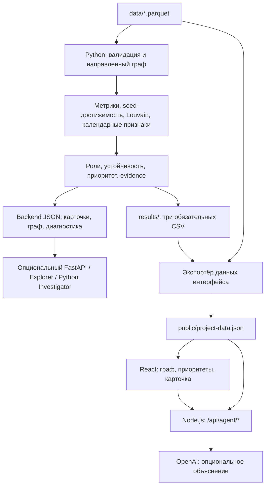

# MoneyGraph Investigator

**Объяснимый анализ графа денежных переводов для AML-аналитика.** Проект команды Aman AI для HackAlem AI, кейс «Граф денег».

MoneyGraph помогает специалисту финансового мониторинга ответить на вопрос: **«Какие узлы проверять в первую очередь и почему?»** Из обезличенной выгрузки переводов система строит направленную сеть, рассчитывает функциональные роли и приоритеты, выделяет сообщества и показывает численные основания в интерфейсе.

Роли — гипотезы для дальнейшей проверки. Оценки системы не являются вероятностью нарушения, а структура графа не доказывает виновность или принадлежность к преступной группе.

## Быстрый запуск для организаторов

С установленным и запущенным **Docker с Compose v2** из корня репозитория:

```bash
docker compose up --build
```

Откройте **http://localhost:8080**. Контейнер сам устанавливает зависимости, дважды рассчитывает исходные данные, проверяет CSV и собирает приложение; локальные Python/Node и AI-ключи не нужны. Первая сборка требует интернета для образов и пакетов. Остановка: `Ctrl+C`, затем `docker compose down`. Как извлечь три CSV в отдельную папку `results/docker/` и разместить защищённую версию на Render: [инструкция Docker и хостинга](docs/deployment.md). **Docker отсутствует в текущей среде проверки; сборка образа здесь ещё не подтверждена.**

Альтернатива без Docker:

Нужны **Python 3.12+ (кроме 3.14.1; проверено на 3.14.6)** и **Node.js 22.18+ с npm**. Из корня репозитория:

```bash
python3 scripts/run-local.py
```

Команда создаёт `.venv`, устанавливает зафиксированные зависимости Python и npm, **дважды запускает `main.py`**, сравнивает все три CSV побайтово, готовит данные интерфейса, собирает приложение и открывает локальный сервер: **[http://127.0.0.1:5173](http://127.0.0.1:5173)**. Откройте этот адрес в браузере; остановка — `Ctrl+C`. Файл `.env`, AI-ключи, Docker, база данных и заранее подготовленные результаты не нужны. Режим `project` задаётся явно, даже если в окружении разработчика выбран `demo`.

Входные файлы уже включены в текущую версию репозитория. Если организаторы выдали их отдельно, распакуйте архив с папкой `data/` в корень, сохранив исходные имена:

```text
data/
  nodes.parquet          # gid, depth, is_seed
  edges.parquet          # src, dst, sum_kzt, n_tx, depth
  transactions.parquet   # src, dst, date, sum_kzt
```

Это исходный формат [ТЗ](docs/project_description.md) и [описания датасета](starter/READ_2.md). Преобразовывать Parquet в CSV перед запуском не требуется. При отсутствии любого файла команда останавливается с указанием пути. `edges.sum_kzt` — сумма по направленной паре за месяц, а `transactions.sum_kzt` — сумма **одного** перевода; `date` содержит только календарную дату. Канонические суммы берутся из рёбер и сверяются с транзакциями. Браузерный импорт CSV — дополнительный аналитический экран; обязательные роли и три итоговых CSV рассчитываются из полного набора Parquet.

Первой установке нужен доступ к реестрам пакетов (либо заранее подготовленный кеш). Последующие запуски обходятся без установки и сети:

```bash
python3 scripts/run-local.py --skip-install
# Только пересчёт, проверка и production-сборка, без сервера:
python3 scripts/run-local.py --skip-install --prepare-only
# Если порт занят:
python3 scripts/run-local.py --skip-install --port 5180
```

Результаты находятся в `results/{nodes_roles,clusters,top_nodes}.csv`, сборка — в `apps/frontend/dist/`. Локальный `results/reproducibility.json` фиксирует контрольные суммы входов и выходов, длительность обоих пересчётов и размер графа. Для этого набора ожидаются **2 248 узлов, 3 119 рёбер, 4 840 транзакций, 81 исходный клиент, 65 сообществ и 20 строк топ-листа**. Пятиминутный лимит проверяется для каждого пересчёта отдельно; установка зависимостей и сборка интерфейса в него не входят.

В Windows используйте `py -3 scripts/run-local.py`; расположение Python внутри `.venv` определяется автоматически.

### Почему три CSV, а в браузере выбирается один файл

Это разные сценарии. Вход задания — **три Parquet-файла** из `data/`. Наш `main.py` рассчитывает **три итоговых CSV** в `results/`, а основной граф автоматически читает их вместе с исходными узлами и рёбрами. Вручную загружать эти CSV в браузер не нужно.

Файлы в `starter/out/` создаёт стартовый код организаторов: роли и обоснования в `nodes_roles.csv` пустые, а `clusters.csv` и `top_nodes.csv` содержат только заголовки. Это шаблоны для реализации, не готовый аналитический результат и не входные данные. Для сдачи используются заполненные файлы из `results/`.

Кнопка **«CSV переводов»** открывает дополнительный обзор одной таблицы `src,dst,amount_kzt` или `src,dst,date,sum_kzt`. Она показывает суммы и связи, но не рассчитывает обязательные роли и кластеры. Даже три итоговых CSV не содержат исходных направленных рёбер; из них одних нельзя восстановить граф. Одна таблица переводов также не включает 19 изолированных исходных клиентов и признаки `depth`/`is_seed` из `nodes.parquet`.

Проверенные обязательные требования и границы проверки: [аудит соответствия кейсу](docs/case-requirements-audit.md).

## Что реализовано

- **Локальный воспроизводимый пайплайн:** проверка трёх Parquet-файлов, расчёт метрик и создание обязательных CSV одной командой `python main.py`. После установки зависимостей ему не нужны интернет, GPU, AI-ключи или база данных.
- **Объяснимые роли и приоритеты:** шесть правил оценки, отдельные `role_score` и `priority_score`, текстовое обоснование для каждого узла, топ-20 кандидатов для проверки.
- **Анализ структуры:** входящие и исходящие объёмы и связи, PageRank, betweenness, достижимость от исходных клиентов, сообщества Louvain. Для 50 предварительно приоритетных узлов рассчитывается влияние удаления на связность и достижимость сети.
- **Календарные признаки:** доля исходящего объёма с входящей активностью в тот же день, за один или за два дня ранее, максимальное число операций за день и синхронность входящих. Эти признаки участвуют в оценке транзита и приоритета; они не сопоставляют конкретные входящие и исходящие деньги.
- **Backend для исследования:** вместе с CSV создаются карточки `node_cards.json`, направленный `graph.json` и `analytics_diagnostics.json`. Опциональный FastAPI обслуживает эти результаты, а консольный Explorer показывает метрики и формулы без AI.
- **Интерактивный граф:** поиск по точному GID, выбор узла, направление и вес переводов, масштабирование и локальный обход на 1–4 перехода с выбором входящих или исходящих связей. Есть фильтры по роли, кластеру, глубине, seed, приоритету и объёму.
- **Рабочее место аналитика:** граф на всю рабочую область; список приоритетов, фильтры и карточка открываются по запросу. Выбор узла показывает прямых соседей; доступны входящие/исходящие связи, 1–4 шага, центрирование и возврат к предыдущему клиенту. Один вход в AI-чат находится в шапке. Наблюдаемые потоки, обоснования, кластеры и экспорт CSV сохранены.
- **Ограничения наблюдения в интерфейсе:** предупреждения о глубине 4 и неполных входящих потоках исходных клиентов; отсутствующие аналитические поля обозначаются как недоступные.
- **Опциональный AI-помощник:** серверные запросы к OpenAI для объяснения рассчитанных фактов со ссылками на GID. В чате используется OpenAI; требуется действующий ключ, основной сценарий работает без него.

Текущие файлы дают **2 248 узлов, 3 119 направленных рёбер, 4 840 транзакций, 81 seed-клиента, 65 кластеров и топ-20**. Это характеристики предоставленного набора, а не заявленная точность обнаружения нарушений.

## Как работает решение

1. Пользователь размещает исходную выгрузку в `data/` и запускает `python main.py` в подготовленном окружении либо `python3 scripts/run-local.py` для полного запуска приложения. Данные кейса включены в репозиторий. Дополнительный импорт CSV в браузере показывает наблюдаемые суммы и связи без присвоения аналитических ролей.
2. Пайплайн проверяет схемы, идентификаторы, суммы и соответствие агрегированных рёбер транзакциям. Направленный граф сохраняет циклы и связи между разными уровнями глубины.
3. Рассчитываются метрики, достижимость от seed-клиентов, сообщества, календарные признаки, роли, приоритеты и детерминированные текстовые обоснования.
4. Три CSV, JSON-карточки, граф и аналитическая диагностика сохраняются в `results/`. Перед запуском или сборкой интерфейса отдельный экспортёр объединяет CSV с узлами и рёбрами в локальный `project-data.json`. Этот путь показывает актуальные итоговые оценки, но пока не переносит подробные метрики из backend JSON в карточку браузера.
5. Аналитик открывает список приоритетов или вводит GID, изучает карточку, связи и кластер, сверяет основания и ограничения. При настроенных ключах он может запросить объяснение у AI-помощника.

### Как определяются роли

Используются формулы, а не обученный классификатор: размеченных правильных ролей в датасете нет. Большинство признаков нормируются относительно узлов **той же глубины**. Для группы из `N` узлов процентиль равен `(средний ранг − 1) / (N − 1)`; одинаковые значения получают одинаковый ранг. Для постоянной, единичной или невалидной группы используется `0`.

Обозначения: `P(x)` — процентиль признака внутри глубины; `I` и `O` — наблюдаемые входящий и исходящий объёмы; `S` — процентиль числа различных seed, от которых существует направленный путь к узлу. Дополнительные признаки:

- `R = I / (I + O)` при положительном знаменателе, иначе `0` — наблюдаемый сигнал удержания.
- `B = max(0, 1 − abs(ln((O + 1)/(I + 1))))` — сходство наблюдаемых входящего и исходящего объёмов.
- `C = 1`, если есть и входящие, и исходящие связи, иначе `0`.
- `Z = 1`, если исходящих связей нет, иначе `0`.
- `T` — доля исходящего объёма, для которого есть входящая активность в день перевода, за один или за два календарных дня до него. Это согласованность дат, не доказательство движения одних и тех же средств.

| Роль | Формула и применимость |
| --- | --- |
| `consolidator` — признаки консолидации | `0.30·P(отправители) + 0.25·P(I) + 0.30·S + 0.15·R`; при глубине 4 вклад `R` равен нулю из-за обрыва наблюдения. |
| `transit` — признаки транзита | `0.25·mean(P(in_degree), P(out_degree)) + 0.30·B + 0.25·T + 0.20·C`; только при глубине 1–3. |
| `distributor` — признаки распределения | `0.50·P(получатели) + 0.25·P(O) + 0.25·P(out_degree)` |
| `terminal` — признаки конечного получателя в наблюдаемой сети | `0.50·P(I) + 0.30·R + 0.20·Z`; только при глубине 1–3 и `I > 0`. |
| `coordinator` — структурно значимый узел | `0.30·P(PageRank) + 0.30·P(betweenness) + 0.20·P(число соседних сообществ) + 0.20·S`. Это структурная гипотеза, не утверждение о руководящей роли. |
| `peripheral` — недостаточно выраженных признаков | Выбирается, если все допустимые основные роли имеют оценку ниже `0.55`. Её оценка — `1 − max` оценок **допустимых** основных ролей, ограниченная `[0,1]`. |

Иначе выбирается допустимая роль с наибольшей оценкой. При равенстве действует порядок: `coordinator`, `consolidator`, `transit`, `distributor`, `terminal`. `role_score` — оценка выбранной роли, а не вероятность её истинности. Текущие количества ролей, включая `transit`, и кандидаты для разбора доступны в `results/analytics_diagnostics.json` и через `explore.py roles`.

`seed_reach_count` считает различные исходные GID с наблюдаемым направленным путём к узлу. Повторные пути от одного seed не увеличивают счётчик; достижимость не доказывает движение одних и тех же денег.

### Приоритет и сообщества

Приоритет проверки рассчитывается отдельно от роли:

```text
priority_score = 0.30 × вес_роли × role_score
               + 0.25 × seed_convergence
               + 0.15 × centrality
               + 0.15 × процентиль_наблюдаемого_объёма
               + 0.10 × temporal
               + 0.05 × resilience_pct
```

`centrality` — среднее процентилей PageRank и betweenness; `temporal` — максимум из `T`, процентиля дневного числа операций и процентиля максимального числа разных отправителей за день. Веса ролей: `1.0` для consolidator/coordinator, `0.85` для transit, `0.80` для distributor, `0.45` для terminal, `0.15` для peripheral. Устойчивость оценивается для 50 кандидатов по предварительному приоритету: учитываются изменения крупнейшей слабосвязной компоненты и числа достижимых пар «seed → не-seed» после удаления узла. Для остальных вклад равен нулю.

Оценки ограничены диапазоном `[0, 1]`, экспортируются с шестью знаками после запятой. Топ-лист упорядочивается по убыванию приоритета, при равенстве — по GID.

Louvain работает на взвешенной **неориентированной проекции** с весом `log1p(sum_kzt)`, `resolution=1.0` и `seed=42`. Номера сообществ стабилизируются сортировкой по минимальному GID и размеру. Направление денежных потоков анализируется по исходному направленному графу. Сообщество означает структурную связанность переводами.

Подробности: [аналитический дизайн](docs/moneygraph-investigator-design.md), [реализация ролей](apps/backend/moneygraph/roles.py), [расчёт приоритета](apps/backend/moneygraph/priority.py).

## Технологии

| Компонент | Используемые технологии |
| --- | --- |
| Аналитика | Проверено на Python 3.14.6; pandas 3.0.6, PyArrow 25.0.1, NetworkX 3.7, SciPy 1.18.1, NumPy 2.5.3. Полный набор runtime-зависимостей зафиксирован в `requirements.txt`. |
| Форматы данных | Parquet на входе, UTF-8 CSV для результатов, JSON для интерфейса. |
| Интерфейс | TypeScript 6, React 19, Vite 8, Tailwind CSS 4, shadcn/Radix, Lucide, Zod. |
| Визуализация графа | `react-force-graph-2d`, Canvas. |
| Опциональный API аналитики | FastAPI и Uvicorn; обслуживание заранее рассчитанных JSON/CSV. |
| Сервер AI | Node.js, официальный SDK `openai`, OpenAI Responses API с вызовом инструментов. Модель по умолчанию: `gpt-4.1-mini`; переопределяется через `OPENAI_MODEL`. |
| Проверки | pytest, unittest, Vitest, Oxlint, Playwright MCP. |

Названия AI-моделей — значения конфигурации текущего кода. Их доступность зависит от учётных данных провайдера. Внешние модели не рассчитывают обязательные роли, оценки, кластеры или CSV-обоснования.

## Архитектура проекта



```text
main.py                         # Точка входа обязательного пайплайна
data/                           # Три исходных Parquet-файла
results/                        # CSV, JSON-карточки и граф, диагностика
apps/backend/moneygraph/         # Валидация, граф и аналитические модули
apps/backend/explore.py          # Консольный разбор метрик и формул
apps/backend/investigate.py      # Опциональный Python AI Investigator
apps/backend/tests/             # Проверки аналитики
apps/frontend/src/              # Интерфейс и адаптеры данных
apps/frontend/scripts/          # Экспорт данных и браузерные проверки
apps/frontend/server/           # Серверная интеграция AI
docs/                           # ТЗ, дизайн и контракты
starter/                        # Исходные материалы организаторов
```

Основной путь интерфейса — **CSV + исходные узлы/рёбра → локальный JSON → интерфейс**. Backend также предоставляет самостоятельный HTTP API с полными карточками. Его фактические payload отличаются от прежнего API-адаптера интерфейса, поэтому обычный запуск использует проверенный режим `project`. Сервер `/api/agent/*` обслуживает браузерного AI-помощника; отдельный Python API предоставляет `/api/investigate`.

## Установка и запуск

### Требования

- Python **3.12+**, кроме **3.14.1** (несовместима с текущим NetworkX); проверено на **3.14.6**. `.python-version` задаёт исходную версию разработки, а не обязательную patch-версию.
- Node.js **22.18 или новее** и npm; требование зафиксировано в пакете frontend.
- Три файла `data/nodes.parquet`, `data/edges.parquet`, `data/transactions.parquet`.
- Интернет для первоначальной установки зависимостей; далее основная аналитика и просмотр работают локально.

Команды ниже выполняются **из корня репозитория** в macOS/Linux. В Windows замените `.venv/bin/python` на `.venv\Scripts\python.exe`; при необходимости задайте `MONEYGRAPH_PYTHON` для экспортёра интерфейса.

### 1. Подготовить Python и рассчитать результаты

Убедитесь, что `python3 --version` показывает нужную версию, затем выполните:

```bash
python3 -m venv .venv
.venv/bin/python -m pip install -r requirements.txt
.venv/bin/python main.py
```

После активации окружения эквивалентная команда полного пересчёта — **`python main.py`**. Для предоставленных данных ожидается сообщение:

```text
MoneyGraph complete: 2248 nodes, 65 clusters, 20 top nodes in ...s.
```

| Файл результата | Строк данных | Колонки |
| --- | --- | --- |
| `results/nodes_roles.csv` | 2 248 | `gid,role,role_score,cluster_id,priority_score,evidence` |
| `results/clusters.csv` | 65 | `cluster_id,n_nodes,n_seed,sum_kzt_internal,top_gids,hypothesis` |
| `results/top_nodes.csv` | 20 | `rank,gid,role,priority_score,why` |

Дополнительно создаются `results/node_cards.json` (полные карточки с шестью оценками, применимостью ролей, метриками, компонентами приоритета и следующим шагом), `results/graph.json` (направленные узлы и рёбра) и `results/analytics_diagnostics.json` (распределения ролей и диагностические кандидаты). JSON дополняют обязательные CSV.

GID в JSON передаются строками, в CSV сохраняются точным десятичным текстом. При открытии CSV в табличном редакторе импортируйте GID как текст, чтобы не потерять разряды.

### 2. Запустить интерфейс на данных проекта

```bash
npm --prefix apps/frontend ci
npm --prefix apps/frontend run dev -- --host 127.0.0.1
```

Откройте адрес Vite, обычно [http://127.0.0.1:5173](http://127.0.0.1:5173). Режим по умолчанию — `project`, в интерфейсе отображается **«Данные проекта»**. Файл `.env` для этого сценария не требуется. Если он уже существует, проверьте, что `VITE_DATA_MODE=project`.

Перед `dev` и `build` автоматически запускается экспортёр: проверяет CSV и исходные узлы/рёбра, создаёт игнорируемый Git файл `apps/frontend/public/project-data.json`. Сам экспортёр не запускает аналитический пайплайн. Если источники отсутствуют или невалидны, подготовка завершается ошибкой.

После изменения исходных данных или пересчёта результатов обновите экспорт и перезагрузите страницу:

```bash
.venv/bin/python main.py
npm --prefix apps/frontend run data:project
```

### 3. Собрать и посмотреть production-сборку локально

```bash
npm --prefix apps/frontend run build
npm --prefix apps/frontend run preview -- --host 127.0.0.1
```

Готовые файлы находятся в `apps/frontend/dist/`; адрес предварительного просмотра выводится в терминале.

### 4. Опционально подключить AI

Создайте корневой `.env` по образцу [.env.example](.env.example), если такого файла ещё нет. Заполните `OPENAI_API_KEY`; при необходимости задайте `OPENAI_MODEL` вместо модели по умолчанию `gpt-4.1-mini`. Оставьте `VITE_DATA_MODE=project` и перезапустите Vite. Чат отправляет запросы к OpenAI через сервер приложения.

Ключ читается только сервером. Не добавляйте ему префикс `VITE_` и не сохраняйте заполненный `.env` в Git. В OpenAI передаются вопрос и полученные инструментами факты о выбранных узлах, приоритетах или кластере.

`dev` и `preview` включают маршруты `/api/agent/status` и `/api/agent/chat`. При отдельном размещении статического интерфейса предусмотрена команда:

```bash
npm --prefix apps/frontend run agent
```

Она запускает AI-сервис на `127.0.0.1:8787` (`AGENT_PORT` меняет порт). Для доступа из размещённого интерфейса нужен reverse proxy для `/api/agent/*`; авторизация пользователей в текущем прототипе не реализована.

### Режимы источника данных

| `VITE_DATA_MODE` | Назначение |
| --- | --- |
| `project` | По умолчанию: реальные файлы текущего проекта. Аналитический HTTP-сервер не требуется. |
| `demo` | Явно выбранные синтетические данные для демонстраций интерфейса и тестов. Не являются результатами анализа датасета. |
| `api` | Адаптер прежнего frontend-контракта. Перед подключением текущего FastAPI нужно согласовать формы карточки, подграфа и поиска; одних `VITE_API_BASE_URL` и `ANALYTICS_API_BASE_URL` недостаточно. Для обычного запуска используйте `project`. |

Подробнее о режимах и настройках: [README фронтенда](apps/frontend/README.md).

### Опциональный backend API и консольный Explorer

API работает с предварительно рассчитанными результатами. Сначала выполните `main.py`, затем из корня репозитория:

```bash
.venv/bin/python -m pip install -r apps/backend/requirements-api.txt
.venv/bin/python -m uvicorn moneygraph.api:app --app-dir apps/backend --host 127.0.0.1 --port 8000
```

Доступны `GET /health`, `/api/top-nodes`, `/api/nodes/{gid}`, `/api/nodes/{gid}/subgraph?hop=1`, `/api/clusters/{cluster_id}` и `/api/search?gid=...`. Локальный подграф ограничен 250 узлами и одним или двумя переходами; поиск поддерживает точный GID и префикс. CORS разрешает `localhost:5173` и `127.0.0.1:5173`. После пересчёта файлов перезапустите API: снимок загружается при старте. При отсутствии результатов `/health` сообщает `artifacts_ready: false`, а запросы данных возвращают 503. Форматы карточек, ограничения и ошибки описаны в [backend handoff](docs/backend/frontend-handoff.md).

Для разбора данных без браузера и без API-сервера:

```bash
.venv/bin/python apps/backend/explore.py
.venv/bin/python apps/backend/explore.py top
.venv/bin/python apps/backend/explore.py roles
.venv/bin/python apps/backend/explore.py explain 100000006638021100
```

Explorer рассчитывает актуальные признаки и показывает формулы роли и приоритета, применимость ролей, наблюдаемые связи, seed-достижимость и ограничения.

### Опциональный Python AI Investigator

Это отдельный backend-интерфейс к рассчитанным фактам. Для него установите зависимости и задайте `OPENAI_API_KEY` и `OPENAI_MODEL` **в окружении процесса**; Python Investigator не загружает корневой `.env` автоматически. Используйте модель с доступом к Responses API и вызовам инструментов в вашей учётной записи.

```bash
.venv/bin/python -m pip install -r apps/backend/requirements-ai.txt
.venv/bin/python apps/backend/investigate.py "Почему узел 100000006638021100 важен?"
```

При запущенном FastAPI тот же сценарий доступен через `POST /api/investigate` с телом `{"question":"..."}`. Реализованы `get_node`, `get_cluster`, `find_common_downstream`, `get_paths`, `get_seed_paths`, `get_temporal_patterns` и `compare_nodes`. Запрос ограничен 2 000 символами, выполнение — шестью раундами модели и двенадцатью вызовами инструментов. Ответ содержит объяснение и журнал полученных фактов; пути и выборки ограничены и сопровождаются предупреждениями о полноте. Модель не изменяет роли, приоритеты или файлы результатов.

Без SDK или настройки AI этот маршрут возвращает 503; детерминированный API и `main.py` продолжают работать. Живой доступ к модели требует отдельной проверки с действующими ключами. Подробности: [контракт и проверенный объём AI](docs/backend/ai-investigator.md).

## Как проверить решение

### Сценарий для жюри

1. Запустите `python3 scripts/run-local.py`. Команда сама проверит повторяемость трёх CSV; проверьте ожидаемые числа строк из таблицы выше.
2. Запустите интерфейс и убедитесь, что указан источник **«Данные проекта»**.
3. Откройте первый узел в актуальном списке приоритетов. Сверьте его GID, роль, `priority_score` и обоснование с первой строкой `results/top_nodes.csv`. Через `explore.py explain <gid>` или `results/node_cards.json` проверьте отдельные компоненты оценки; браузерная карточка в режиме `project` показывает доступные CSV-поля и наблюдаемые потоки.
4. Выберите узел, переключите входящие и исходящие связи, измените число переходов и отцентрируйте граф. Перейдите к соседу и вернитесь к предыдущему клиенту. Откройте кластер выбранного клиента и сравните сводку с `results/clusters.csv`.
5. Найдите **`100000000404740100`**: это узел глубины 4. Проверьте предупреждение о границе наблюдения и недопустимость роли `terminal`. Отсутствие исходящих здесь не означает, что средства окончательно остановились. Для разбора транзита выберите актуальный пример через `explore.py roles` или `analytics_diagnostics.json`.
6. Введите отсутствующий GID, например `1`, — интерфейс должен сообщить, что клиент не найден. Для второго кандидата из топ-листа можно использовать **`100000004015047100`**.
7. Если настроен OpenAI, откройте AI-помощника и отправьте: «Почему выбранный узел находится в списке приоритетов? Укажи факты и ограничения». Проверьте ссылки на GID и сопоставьте числа с карточкой. Этот шаг опционален.

### Проверка воспроизводимости CSV

Следующая команда дважды запускает полный пайплайн и сравнивает SHA-256 трёх результатов:

```bash
.venv/bin/python - <<'PY'
from pathlib import Path
from hashlib import sha256
import subprocess
import sys

files = [Path('results') / name for name in (
    'nodes_roles.csv', 'clusters.csv', 'top_nodes.csv'
)]
def run():
    subprocess.run([sys.executable, 'main.py'], check=True)
    return {path.name: sha256(path.read_bytes()).hexdigest() for path in files}

assert run() == run(), 'Результаты двух запусков различаются'
print('Все три CSV побайтово совпадают.')
PY
```

### Автоматические проверки

После подготовки данных и установки frontend-зависимостей:

```bash
# Аналитические тесты: установить дополнительные зависимости.
.venv/bin/python -m pip install -r apps/backend/requirements-dev.txt
PYTHONPATH=apps/backend .venv/bin/python -m pytest apps/backend/tests -q

# Проверка экспортёра проектных данных.
.venv/bin/python -m unittest discover -s apps/frontend/scripts -p 'test_export_project_data.py' -q

# Интерфейс и серверная логика AI с подставными ответами провайдера.
npm --prefix apps/frontend run data:project
npm --prefix apps/frontend test
npm --prefix apps/frontend run lint
npm --prefix apps/frontend run build
```

Для браузерного сценария установите Chromium из пакета frontend и оставьте работающим dev-сервер на порту 5173 в режиме `project`:

```bash
cd apps/frontend
npx playwright install chromium
npm run qa:project
```

Сценарий использует Playwright MCP, проверяет проектные данные, карточку, граф, границу наблюдения и состояния загрузки/ошибки. Отчёты и снимки сохраняются в игнорируемый каталог `apps/frontend/qa/`.

**Проверка объединённой версии:** `run-local.py` выполнил оба пересчёта за 2,17 и 1,76 секунды, подтвердил побайтовое совпадение CSV и успешную production-сборку. Прошли 51 backend-тест, 128 тестов frontend/серверного помощника, 16 тестов экспортёра и 62 браузерные проверки через Playwright MCP. Это измерения на текущем рабочем окружении; свежая установка объединённой версии на другой машине отдельно не заявляется.

**Исторические отчёты:** [чистый запуск для организаторов](docs/organizer-reproducibility.md) и [обзор проекта](docs/project-review-2026-09-23.md) фиксируют состояние до объединения завершённого backend; их контрольные суммы и примеры рейтинга относятся к той версии. Отдельный [отчёт backend](docs/backend/completion-report.md) описывает проверку календарных признаков, JSON, API и инструментов исследования на его ветке. Для повторения текущей проверки выполните команды выше: `run-local.py` проверит повторяемость CSV и запишет актуальные хеши и время в `results/reproducibility.json`.

## Данные и интеграции

Источник — обезличенный датасет организаторов: **внутрибанковские переводы за 1–31 июля 2026 года**, обход по исходящим переводам от 81 seed на четыре колена, порог суммы **5 000 KZT**. Описание: [starter/READ_2.md](starter/READ_2.md). По [условиям кейса](docs/project_description.md) данные предоставлены для использования в рамках хакатона.

| Файл | Содержимое и использование |
| --- | --- |
| `data/nodes.parquet` | `gid`, минимальная глубина обнаружения `depth`, признак исходного клиента `is_seed`. |
| `data/edges.parquet` | Агрегированные направленные пары `src → dst`, `sum_kzt`, `n_tx`, шаг обхода `depth`. Канонический источник структуры и денежных объёмов. |
| `data/transactions.parquet` | Отдельные строки переводов с календарной датой и суммой. Используются для сверки агрегатов и календарных признаков: согласованности входящей/исходящей активности, дневных всплесков и синхронности входящих. |

Повторяющиеся строки транзакций сохраняются: уникального идентификатора операции в данных нет. На границе Python/JSON/JavaScript GID остаётся строкой, поскольку его значение может превышать точность JavaScript `number`.

Подключения к банковским системам или внешним источникам персональных данных нет. Внешние AI-интеграции опциональны. Браузерный помощник использует `get_node`, `get_top_nodes` и `get_cluster`. Отдельный Python Investigator предоставляет семь инструментов, включая наблюдаемые пути, общих потомков, календарные признаки и сравнение узлов; автоматически в браузерный чат они не подключены.

## Ограничения текущей версии

- **Неполная картина переводов.** Это один месяц, один банк и операции от установленного порога. Входящие потоки seed могут быть неполны. Разность входящих и исходящих объёмов не является балансом счёта.
- **Глубина 4 — граница выгрузки.** За ней движение денег неизвестно. Узлы этой глубины не допускаются к роли `terminal`; наблюдаемое удержание исключается из оценки `consolidator`.
- **Даты без времени суток.** Календарные признаки рассчитываются, но утверждения о переводах «через несколько минут» не поддерживаются данными. Согласованность дат и наличие пути не доказывают движение одних и тех же денег.
- **Нет размеченной истины.** Формулы дают объяснимые гипотезы; измеренная точность классификации или обнаружения нарушений не заявляется.
- **Карточка браузера показывает часть backend-данных.** Полные seed-метрики, шесть оценок с применимостью, календарные признаки, разложение приоритета и следующий шаг есть в `node_cards.json` и FastAPI. Текущий экспортёр режима `project` читает CSV и исходные узлы/рёбра, поэтому эти подробности остаются недоступны в браузерной карточке; часть чисел содержится в evidence.
- **Контракт HTTP-адаптера интерфейса требует согласования.** Backend API реализован; его фактические формы карточек, подграфов и результатов поиска отличаются от прежнего frontend-контракта. Полный рабочий запуск интерфейса использует локальный режим `project`.
- **AI ограничен доступными инструментами и выборками.** В Python Investigator реализованы ограниченные поиски путей, общих потомков и календарных признаков; при исчерпании лимитов результат не считается полным. Ответы зависят от доступа к OpenAI и действующих ключей; выводы нужно сверять с рассчитанными фактами.
- **Версия ориентирована на датасет хакатона.** Валидатор обязательного результата ожидает 2 248 узлов и 20 строк топ-листа. Для набора другого размера потребуется адаптация проверки. Браузерный импорт CSV предоставляет отдельные наблюдаемые метрики и граф; роли, приоритеты и обязательные CSV он не рассчитывает. Потоковая обработка и многопользовательская авторизация не реализованы.

### Что потребуется для графа около 1 млн узлов

Это направление развития, а не реализованная производительность: перенести графовые расчёты с NetworkX на оптимизированный движок, например igraph/graph-tool; использовать колоночную обработку и приближённую betweenness; сохранить битовые маски достижимости там, где это применимо; применять масштабируемую реализацию Louvain/Leiden. Метрики и кандидатов следует предрассчитывать, а интерфейсу отдавать ограниченные подграфы через API вместо полной выгрузки графа. Анализ удаления узлов должен оставаться ограниченным набором кандидатов.

## Размещённая версия

Подготовлены [Dockerfile](Dockerfile) и [Render Blueprint](render.yaml) для одного бесплатного web-сервиса с данными проекта. На Render доступ защищён сгенерированным паролем, логин — `judge`; AI по умолчанию выключен. **Размещение ещё не выполнено, подтверждённой hosted-ссылки нет.** Нужны Render-аккаунт и право подключить репозиторий `BAITC-Hacks/hack-7cf34f56-aman-ai`. Пошаговая настройка, ограничения бесплатного плана и проверка: [docs/deployment.md](docs/deployment.md).

## Документация проекта

- [ТЗ кейса и критерии жюри](docs/project_description.md).
- [Проверка чистого запуска для организаторов](docs/organizer-reproducibility.md).
- [Docker для жюри и защищённая ссылка Render](docs/deployment.md).
- [Датасет и схема исходных файлов](starter/READ_2.md).
- [Архитектура и формулы аналитики](docs/moneygraph-investigator-design.md).
- [Контракт обязательных выгрузок](docs/backend/output-contract.md).
- [Фактический backend API и карточки](docs/backend/frontend-handoff.md).
- [Завершение backend и проведённые проверки](docs/backend/completion-report.md).
- [Инструменты Python AI Investigator](docs/backend/ai-investigator.md).
- [План масштабирования](docs/backend/scaling.md).
- [Настройка интерфейса, режимы данных и AI](apps/frontend/README.md).
- [Устройство и управление графом](docs/aml-graph.md).
- [Пользовательский сценарий и план интеграции](docs/frontend-requirements-and-pipeline.md).
- [Контракт интерфейса](docs/moneygraph-ui-design-contract.md).

Документы дизайна также содержат планы развития; статус текущей реализации и её ограничения описаны выше.
