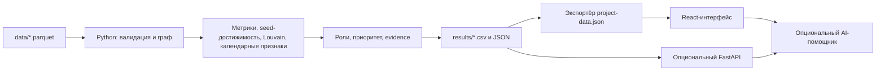

# MoneyGraph Investigator

**MoneyGraph Investigator** — проект команды Aman AI для кейса HackAlem AI «Граф денег». Это инструмент для AML-аналитика: он помогает понять, какие узлы в обезличенном графе переводов стоит изучить в первую очередь и на каких наблюдаемых данных основана эта рекомендация.

Проект не определяет виновность и не устанавливает связи с преступной деятельностью. Роли, приоритеты и сообщества — объяснимые гипотезы для дальнейшей проверки аналитиком.

## Какую проблему решает проект

В крупном графе переводов сложно вручную увидеть точки концентрации, распределения, транзита и структурно важные связи. MoneyGraph строит направленный граф из выгрузки, рассчитывает признаки для каждого клиента, формирует список приоритетных узлов и даёт аналитику возможность проверить основания через интерактивный граф.

Целевая аудитория — аналитики финансового мониторинга и жюри хакатона, которым нужно воспроизводимо проверить расчёт и результат на предоставленном датасете.

## Что реализовано

- Воспроизводимый Python-pipeline: валидация трёх Parquet-файлов, построение направленного графа и создание обязательных CSV.
- Шесть объяснимых функциональных ролей: `consolidator`, `transit`, `distributor`, `terminal`, `coordinator`, `peripheral`.
- Отдельные `role_score` и `priority_score`: совпадение с ролью не смешивается с полезностью узла для проверки.
- Расчёт входящих и исходящих наблюдаемых объёмов, степеней, PageRank, betweenness, достижимости от seed-узлов, сообществ Louvain и календарных признаков.
- Детерминированные текстовые обоснования для каждого узла и топ-20 приоритетных кандидатов.
- Интерактивный React-интерфейс: поиск по GID, карточка клиента, фильтры, направленные связи, локальный обход на 1–4 шага, сообщества и экспорт наблюдаемых переводов в CSV.
- Предупреждения о границе наблюдения на глубине 4 и неполноте входящих потоков seed-узлов.
- Опциональные FastAPI и AI Investigator для исследования уже рассчитанных фактов. Они не меняют роли, оценки, кластеры или обязательные CSV.
- Docker Compose для запуска одной командой без локальной установки Python или Node.js.

Для включённого датасета pipeline формирует 2 248 узлов, 3 119 направленных рёбер, 4 840 транзакций, 65 сообществ и топ-20 узлов. Это характеристики конкретной выгрузки, а не показатель точности выявления нарушений.

## Как работает решение

1. Пользователь помещает в `data/` три исходных Parquet-файла или использует уже включённые в репозиторий.
2. `main.py` проверяет схему, GID, суммы, даты и согласованность агрегированных рёбер с транзакциями.
3. Pipeline строит направленный граф и рассчитывает структурные, объёмные, календарные и seed-признаки.
4. На взвешенной неориентированной проекции находятся сообщества Louvain; далее рассчитываются роли, приоритеты и обоснования.
5. Результаты сохраняются в `results/` как обязательные CSV и вспомогательные JSON-артефакты.
6. Экспортёр готовит `project-data.json` из результатов и исходных узлов/рёбер, после чего React-интерфейс показывает граф и карточки.
7. Аналитик выбирает узел из списка приоритетов или вводит GID, изучает наблюдаемые связи, численные основания, кластер и ограничения данных.



## Архитектура

| Компонент | Ответственность |
| --- | --- |
| `main.py` | Запускает детерминированный аналитический pipeline и записывает результаты. |
| `apps/backend/moneygraph/` | Валидация, граф, признаки, seed-конвергенция, сообщества, роли, приоритет, evidence и продуктовые JSON. |
| `results/` | Обязательные CSV, карточки узлов, направленный граф и диагностика. |
| `apps/frontend/` | React-интерфейс, подготовка project-данных, просмотр графа и сервер AI-помощника. |
| `apps/backend/moneygraph/api.py` | Опциональный FastAPI, который раздаёт уже рассчитанные артефакты. |
| `Dockerfile` и `docker-compose.yml` | Сборка pipeline и интерфейса, запуск production-сервера. |

Обязательный путь не зависит от API, AI, базы данных, GPU или интернет-соединения после установки зависимостей. Docker-сборка использует интернет только для скачивания базовых образов и пакетов при первой сборке.

## Технологии

| Область | Используемые технологии |
| --- | --- |
| Аналитика | Python, pandas, PyArrow, NetworkX, SciPy, NumPy |
| Вход и результаты | Parquet, UTF-8 CSV, JSON |
| Backend API | FastAPI, Uvicorn, Pydantic |
| Интерфейс | TypeScript, React, Vite, Tailwind CSS, shadcn/Radix, Zod |
| Визуализация | `react-force-graph-2d`, Canvas |
| AI, опционально | OpenAI Responses API и официальный SDK `openai`; NVIDIA API может выступать дополнительным критиком ответа |
| Проверки | pytest, Vitest, Oxlint, Playwright MCP |
| Развёртывание | Docker, Docker Compose; в репозитории есть Render Blueprint, но опубликованной версии нет |

Точные версии зависимостей закреплены в [requirements.txt](requirements.txt), [apps/backend/requirements.txt](apps/backend/requirements.txt) и [apps/frontend/package.json](apps/frontend/package.json).

## Данные и интеграции

Источник данных — обезличенный датасет организаторов. Требуются следующие файлы:

```text
data/
├── nodes.parquet          # gid, depth, is_seed
├── edges.parquet          # src, dst, sum_kzt, n_tx, depth
└── transactions.parquet   # src, dst, date, sum_kzt
```

`edges.parquet` — канонический источник структуры, направлений и агрегированных объёмов. `transactions.parquet` используется для проверки агрегатов и календарных признаков. Описание датасета находится в [starter/READ_2.md](starter/READ_2.md).

На границе Python, JSON и JavaScript GID передаются строками: идентификаторы могут быть больше безопасного диапазона JavaScript `number`.

Основной сценарий не требует внешних сервисов. OpenAI и NVIDIA используются только при явной настройке ключей в окружении сервера. Подключений к банковским системам, внешним персональным данным или внешним базам данных нет.

## Установка и запуск

### Быстрый запуск для жюри через Docker

Нужны Docker Engine и Docker Compose v2. В терминале перейдите в корень репозитория и выполните:

```bash
cd /путь/к/hack-7cf34f56-aman-ai
docker compose up --build -d --wait --wait-timeout 120
```

После успешного health check откройте [http://localhost:8080](http://localhost:8080).

Команда внутри образа устанавливает зависимости, дважды запускает `main.py`, сравнивает обязательные CSV побайтово, готовит данные интерфейса и собирает production-версию. Локальные Python, Node.js и AI-ключи не требуются. Docker Compose публикует сервис только на `127.0.0.1`.

Если порт занят, задайте другой перед запуском:

```bash
MONEYGRAPH_PORT=8081 docker compose up --build -d --wait --wait-timeout 120
```

Тогда откройте `http://localhost:8081`.

Остановить приложение:

```bash
docker compose down
```

Извлечь обязательные CSV из работающего контейнера:

```bash
mkdir -p results
mkdir results/docker
docker compose cp moneygraph:/app/results/. results/docker/
```

Подробности о Docker и подготовленном Render Blueprint — в [docs/deployment.md](docs/deployment.md).

### Локальный запуск без Docker

Нужны Python 3.12+ (кроме 3.14.1), Node.js 22.18+ и npm. Самый простой вариант:

```bash
python3 scripts/run-local.py
```

Скрипт создаёт `.venv`, устанавливает зависимости, дважды запускает pipeline, сравнивает хеши CSV, собирает интерфейс и открывает сервер на `http://127.0.0.1:5173`.

Для ручного запуска аналитики:

```bash
python3 -m venv .venv
.venv/bin/python -m pip install -r requirements.txt
.venv/bin/python main.py
```

После расчёта запустите интерфейс:

```bash
npm --prefix apps/frontend ci
npm --prefix apps/frontend run dev -- --host 127.0.0.1
```

Откройте `http://127.0.0.1:5173`. Перед `dev` и `build` экспортёр проверяет результат и готовит локальный `apps/frontend/public/project-data.json`.

### Результаты pipeline

| Файл | Содержимое |
| --- | --- |
| `results/nodes_roles.csv` | GID, роль, оценка роли, кластер, приоритет и evidence для каждого узла. |
| `results/clusters.csv` | Сводка по сообществам. |
| `results/top_nodes.csv` | Ранжированный топ-20 узлов для проверки. |
| `results/node_cards.json` | Расширенные карточки узлов для API и исследовательских инструментов. |
| `results/graph.json` | Направленный граф для продуктовой интеграции. |
| `results/analytics_diagnostics.json` | Диагностические распределения и кандидаты. |

## Как проверить решение

### Сценарий для жюри

1. Выполните Docker-команду из раздела выше и откройте `http://localhost:8080`.
2. Убедитесь, что приложение загрузилось в режиме «Данные проекта».
3. Откройте панель приоритетов и выберите первый узел. Сверьте его GID, роль и причину с первой строкой `results/top_nodes.csv` из контейнера или локального `results/`.
4. В карточке переключите входящие, исходящие и все связи; проверьте обход на 1–4 шага и сводку кластера.
5. Найдите GID `100000000404740100`. Это узел глубины 4: интерфейс должен показать ограничение границы наблюдения, а отсутствие видимых исходящих связей не должно трактоваться как окончательная остановка средств.
6. Введите несуществующий GID, например `1`, и проверьте понятное состояние «не найден».

### Проверка детерминированности без Docker

После установки Python-зависимостей запустите:

```bash
.venv/bin/python main.py
shasum -a 256 results/nodes_roles.csv results/clusters.csv results/top_nodes.csv
.venv/bin/python main.py
shasum -a 256 results/nodes_roles.csv results/clusters.csv results/top_nodes.csv
```

Контрольные суммы трёх файлов после обоих запусков должны совпасть. `scripts/run-local.py` и Dockerfile выполняют эту проверку автоматически.

### Автоматические проверки

```bash
# Backend
.venv/bin/python -m pip install -r apps/backend/requirements-dev.txt
PYTHONPATH=apps/backend .venv/bin/python -m pytest apps/backend/tests -q

# Frontend
npm --prefix apps/frontend run data:project
npm --prefix apps/frontend run lint
npm --prefix apps/frontend test
npm --prefix apps/frontend run test:agent
npm --prefix apps/frontend run build
npm --prefix apps/frontend run test:server
```

Для браузерной проверки требуется работающий локальный интерфейс и Chromium:

```bash
cd apps/frontend
npx playwright install chromium
QA_BASE_URL=http://localhost:8080/ npm run qa:project
```

## Опциональные API и AI

После запуска `main.py` можно поднять аналитический API:

```bash
.venv/bin/python -m pip install -r apps/backend/requirements-api.txt
.venv/bin/python -m uvicorn moneygraph.api:app --app-dir apps/backend --host 127.0.0.1 --port 8000
```

Он отдаёт готовые результаты через `/health`, `/api/top-nodes`, `/api/nodes/{gid}`, `/api/nodes/{gid}/subgraph`, `/api/clusters/{cluster_id}` и `/api/search`. Контракт описан в [docs/backend/frontend-handoff.md](docs/backend/frontend-handoff.md).

AI-помощник требует `OPENAI_API_KEY` в окружении процесса. По умолчанию используется модель `gpt-4.1-mini`, которую можно заменить переменной `OPENAI_MODEL`. NVIDIA-проверка включается отдельно через `NVIDIA_API_KEY`. Ключи не передаются в браузер и не нужны для детерминированного pipeline.

## Ограничения

- Датасет покрывает наблюдаемые операции из предоставленной выгрузки. Входящие потоки seed-узлов могут быть неполными, а разность входящего и исходящего объёма не является балансом счёта.
- Глубина 4 — граница наблюдения. У таких узлов отсутствие исходящих рёбер не означает, что движение средств завершилось; они не получают роль `terminal` только на этом основании.
- В транзакциях есть календарная дата, но нет времени суток. Можно говорить о совпадении дат или интервале в календарных днях, но не о минутах или часах между операциями.
- У датасета нет размеченной истины для ролей. Результаты — объяснимые эвристики, поэтому проект не заявляет точность классификации или обнаружения нарушений.
- Основной интерфейс работает в режиме `project` через локально подготовленный JSON. FastAPI существует, однако его HTTP-контракт пока не является основным интеграционным путём React-интерфейса.
- AI-функции зависят от ключей и доступности провайдеров; ответы ограничены рассчитанными инструментами и требуют проверки аналитиком.
- Для графов значительно большего размера потребуется другой графовый движок, приближённые метрики и выдача ограниченных подграфов вместо полного графа в браузер.

## Размещённая версия

Подтверждённой deployed-версии и публичной ссылки в текущем репозитории нет. В проекте подготовлены [Dockerfile](Dockerfile), [docker-compose.yml](docker-compose.yml) и [render.yaml](render.yaml), но публикация на Render ещё не подтверждена.

## Документация

- [Описание датасета](starter/READ_2.md)
- [ТЗ кейса](docs/project_description.md)
- [Аналитический дизайн](docs/moneygraph-investigator-design.md)
- [Контракт результатов](docs/backend/output-contract.md)
- [Инструкция Docker и Render](docs/deployment.md)
- [Frontend: режимы данных и управление графом](apps/frontend/README.md)
- [Backend API и product-контракт](docs/backend/frontend-handoff.md)
