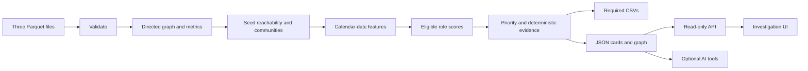

# MoneyGraph Investigator

Local, explainable analysis of the HackAlem observed financial graph for an AML
analyst: which nodes to investigate first, and why. Roles are hypotheses, not
findings of guilt. All numerical facts are deterministic; AI is optional.

## Design documents

- [Investigator architecture and analytical design](docs/moneygraph-investigator-design.md)
- [Analyst workflow, must-have requirements, pipeline handoff and AI integration](docs/frontend-requirements-and-pipeline.md)
- [UI design contract: screens, components, data needs, and acceptance checks](docs/moneygraph-ui-design-contract.md)

## Data and Python

Tested with **Python 3.14.0**, pinned in `.python-version`.
Place the supplied HackAlem files at:
`data/nodes.parquet`, `data/edges.parquet`, `data/transactions.parquet`.
Use the supplied unmodified export (2,248 nodes, 3,119 edges, 4,840 transactions,
81 seeds). These data are for hackathon use; do not add external customer data.

## Setup and mandatory run

From the repository root, with Python 3.14 available as `python3`:

```bash
python3 -m venv .venv
source .venv/bin/activate
python -m pip install -r apps/backend/requirements.txt
python main.py
```

After installing dependencies, the single jury command is **`python main.py`**.
It needs no network, API server, frontend, database, OpenAI or NVIDIA.
Expected runtime is a few seconds on this data, below the five-minute limit.
Validation failures exit nonzero.

Required outputs:
- `results/nodes_roles.csv`: all 2,248 unique gids, role, score, cluster,
  priority, evidence (at most 200 characters).
- `results/clusters.csv`: size, seed count, internal observed KZT, top gids,
  cautious deterministic hypothesis.
- `results/top_nodes.csv`: exact first 20 globally ranked nodes.

Also generated: `node_cards.json`, `graph.json`, `analytics_diagnostics.json`
in results/. Diagnostics include all 72 observed ratio candidates, the highest
Transit scores and role counts by depth and cluster.

## Backend API and Explorer

```bash
python -m pip install -r apps/backend/requirements-api.txt
python -m uvicorn moneygraph.api:app --app-dir apps/backend --host 127.0.0.1 --port 8000
```

The API loads results on startup. Run main.py first; restart after regeneration.
See [actual API payloads and frontend handoff](docs/backend/frontend-handoff.md).
For local exploration in another terminal with the environment active:

```bash
python apps/backend/explore.py
python apps/backend/explore.py top
python apps/backend/explore.py explain 100000006638021100
```

## Explainable roles and priority

All role criteria are independent bounded scores. Percentiles use ascending
average ranks among nodes of the **same depth**; constant/unavailable groups
return zero. The confidence floor is **0.55**. Only eligible roles participate
in selection. Ties: coordinator, consolidator, transit, distributor, terminal.

| Role | Criterion |
|---|---|
| Consolidator | .30 sender percentile + .25 inbound percentile + .30 seed convergence + .15 observed retention; retention contributes zero at depth 4 |
| Transit | .25 mean degree percentiles + .30 flow balance + .25 date-consistent turnover + .20 two-sided continuation; depths 1–3 |
| Distributor | .50 recipient percentile + .25 outbound percentile + .25 outdegree percentile |
| Terminal | .50 inbound percentile + .30 retention + .20 no outgoing; depths 1–3 and observed incoming >0 |
| Coordinator | .30 PageRank percentile + .30 betweenness percentile + .20 bridge percentile + .20 seed convergence |
| Peripheral | 1 − maximum **eligible** non-peripheral score; selected when that maximum <.55 |

Retention = incoming/(incoming+outgoing); it is not a real balance.
Flow balance = max(0, 1−abs(log((outgoing+1)/(incoming+1)))).
Turnover qualifies outgoing amounts on day d when incoming activity exists on
d, d−1 or d−2; it is date consistency, not tracing the same funds.

Priority = .30 role weight×score + .25 seed convergence + .15 mean centrality
percentiles + .15 volume percentile + .10 temporal + .05 resilience percentile.
Role weights: coordinator/consolidator 1, transit .85, distributor .8,
terminal .45, peripheral .15. Temporal is max(turnover, burst, synchronous
incoming). Resilience removes only the preliminary top 50 candidates.
Full definitions: [analytics contract](docs/backend/analytics-contract.md).

## Limitations and reproducibility

- The export follows outgoing transfers; incoming activity outside the export is
  missing, especially for seeds. Observed volumes are not account balances.
- Transfers below 5,000 KZT and outside-bank activity are invisible.
- Depth 4 is the observation boundary; missing outgoing activity is not Terminal
  evidence. Retention is excluded from Consolidator scoring there.
- There is no role ground truth or customer attribute data. Scores are heuristic
  signals, not calibrated probabilities.
- Dates have day precision only; observed paths do not prove movement of the same
  physical funds.
- The graph has cycles/cross-level edges. Seed convergence uses distinct-seed BFS.
- Louvain: sum reciprocal amounts, then log1p, resolution 1, seed 42, stable
  relabeling. The pinned NetworkX environment is authoritative for reproducibility.

## Architecture and scale



For ~1M nodes use an optimized graph engine, approximate betweenness, scalable
communities, columnar processing, cached features and bounded subgraphs; see
[scaling plan](docs/backend/scaling.md). Architecture:
[design](docs/moneygraph-investigator-design.md).

## Tests and five-minute demo

```bash
python -m pip install -r apps/backend/requirements-dev.txt
PYTHONPATH=apps/backend python -m pytest apps/backend/tests -q
```

Demo: run main.py; open Top-20; explain its first gid; explain an ordinary and a
depth-4 gid; show eligibility, observed directed links and one Transit candidate.
Use `explore.py roles` and `results/analytics_diagnostics.json` for current gids.
The interface and backend integration are owned separately; backend completion
does not itself verify the teammate's visualization.

## Frontend

Run the initial demo from the repository root:

```bash
npm --prefix apps/frontend ci
npm --prefix apps/frontend run dev -- --host 127.0.0.1
```

Open http://127.0.0.1:5173. The interface currently uses clearly labeled synthetic data; real backend integration is pending.

See [frontend setup and API adapter](apps/frontend/README.md) and [verification results](docs/frontend-qa-report.md).

## Optional OpenAI Investigator

Install optional dependencies; configure OPENAI_API_KEY and OPENAI_MODEL in your
shell using your own credentials and a Responses tool-calling model available to
your account. They are never needed by main.py and are never sent to the browser.

```bash
python -m pip install -r apps/backend/requirements-ai.txt
python apps/backend/investigate.py "Почему узел 100000006638021100 важен?"
```

The API also provides `POST /api/investigate` with `{"question":"..."}`.
Missing configuration returns 503 while deterministic endpoints remain available.
Questions are bounded to 2,000 characters; the agent uses at most six model turns
and twelve tool calls. Only bounded requested facts are sent, never Parquet files.
Model prose is a hypothesis for analyst verification; facts remain in the tool
trace. Live model access must be tested with your account before an AI demo.
See [AI contract and tested scope](docs/backend/ai-investigator.md).
